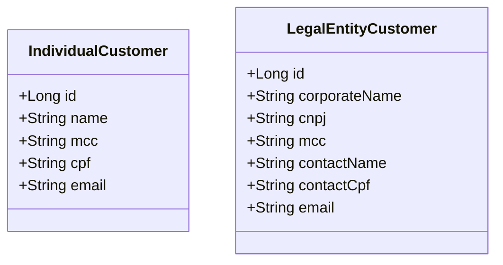

# Customer Prospecting App


## Estrutura de tabelas



# Instruções

## Clonar repositório

```
git clone https://github.com/Akaori/customer-prospecting-app.git

```

## Mudar para diretório do repositório clonado

```
cd customer-prospecting-app
```

## Como entrar no Swagger

- Acessar a seguinte URL:

```
http://localhost:8080/swagger-ui/index.html#/
```


- Testar rotas

- Será necessário colocar as credencias para executar os endpoints:

  - user: `user`
  - password: `user`

> Exemplo de post request: (se o cadastro ou atualização do cadastro não obedecer as regras de cada campo, será mostrado um erro correspondente)


## Como entrar no H2

- Acessar a seguinte URL:

```
http://localhost:8080/h2-console
```

- Preencher os campos de acordo com a imagem abaixo:


- Clicar em `Connect`


## Testes automatizados

- Testes unitários para os serviços
- CI com [Github Actions](https://github.com/Akaori/customer-prospecting-app/actions)