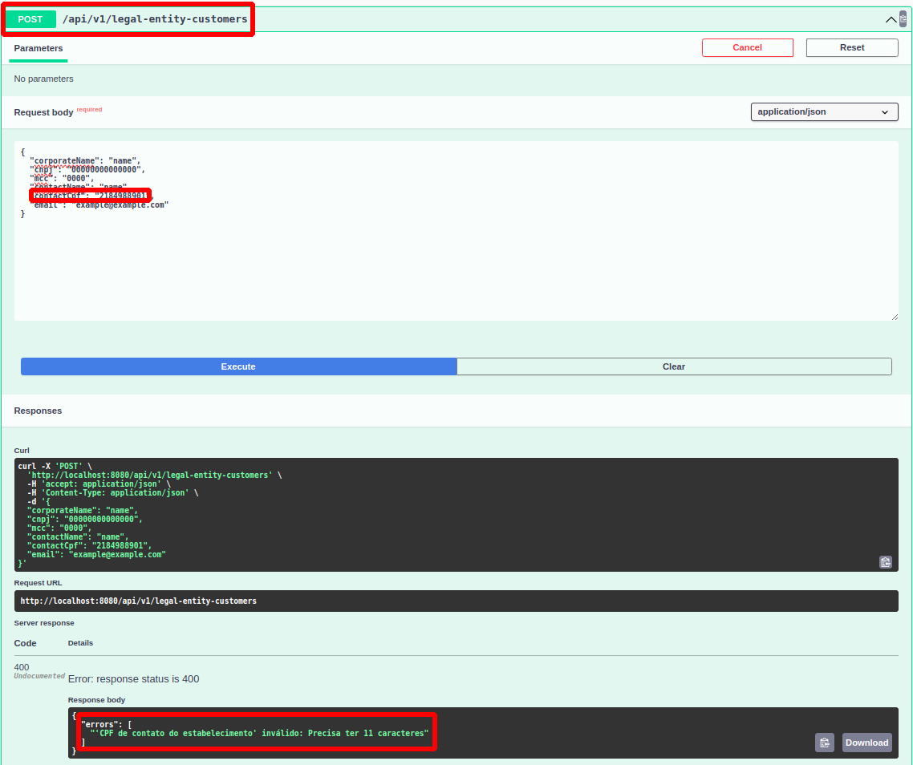
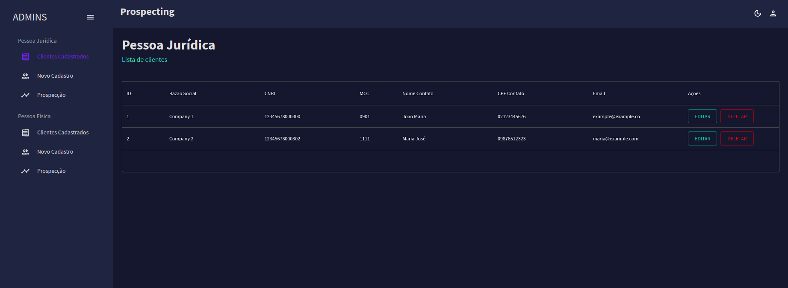
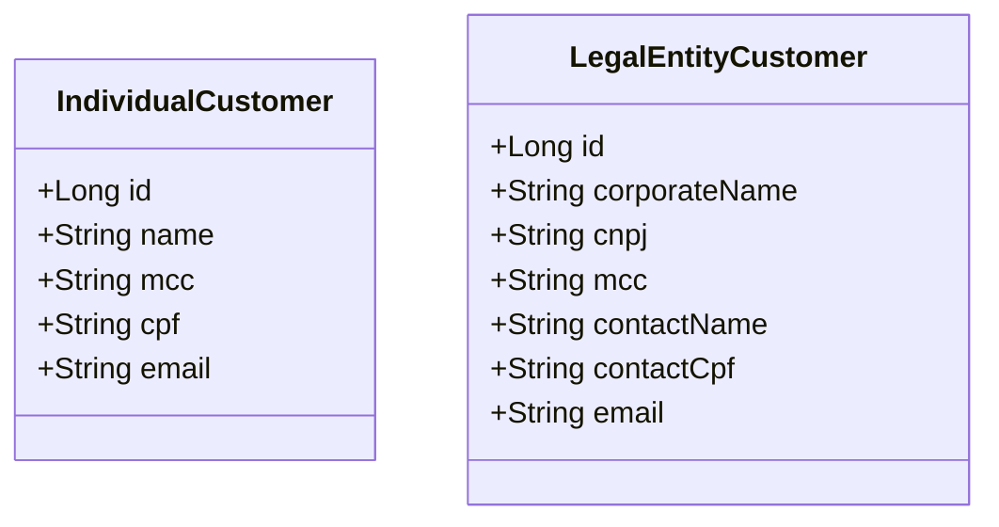

# Customer Prospecting App


# 🔍 Sobre

Aplicação full-stack (front-end e back-end) para manter um pré-cadastro de clientes (prospect) para possibilitar uma futura oferta de produtos e serviços a esses clientes.

Além disso, possui um sistema de fila de atendimento ao prospects, para que cada cliente possa ser analisado de forma sequencial pelos gestores comerciais.

Para ver o projeto, clique [aqui](https://github.com/users/Akaori/projects/3)

# 💻 Instruções para rodar aplicação com o Docker

> É necessário ter o docker e docker-compose instalados. Para instalar no Ubuntu, seguir o seguinte tutorial: 
> https://www.digitalocean.com/community/tutorials/how-to-install-and-use-docker-compose-on-ubuntu-20-04-pt


> Se não tiver o Docker instalado, abaixo há instruções para rodar a aplicação sem o Docker.

### 1. Clonar repositório

```
git clone https://github.com/Akaori/customer-prospecting-app.git

```

### 2. Mudar para diretório do repositório clonado

```
cd customer-prospecting-app
```

### 3. Subir serviços com o docker-compose

```
docker-compose up
```

Os serviços de backend e frontend subirão automaticamente.

# 💻 Instruções para rodar aplicação sem o Docker

### 1. Rodar o backend

[Instruções para rodar backend sem o Docker](https://github.com/Akaori/customer-prospecting-app/tree/main/backend)

### 2. Rodar o frontend

[Instruções para rodar frontend sem o Docker](https://github.com/Akaori/customer-prospecting-app/tree/main/frontend)

# 💡 Instruções de acesso aos serviços

### 1. Como entrar no Swagger

- Acessar a seguinte URL:

```
http://localhost:8080/swagger-ui/index.html#/
```


- Testar rotas

- Será necessário colocar as credencias para executar os endpoints:

  - user: `user`
  - password: `user`

> Exemplo de post request: (se o cadastro ou atualização do cadastro não obedecer as regras de cada campo, será mostrado um erro correspondente)



### 2. Como entrar no frontend

Acessar em:

```
http://localhost:3000/
```




# 🌐 Overview do Projeto

### Estrutura de tabelas



### Acessibilidade WCAG 2 no Frontend

É possível ver alguns pontos da acessbilidade do site no seguinte pull request: https://github.com/Akaori/customer-prospecting-app/pull/44


### Testes automatizados

- [Testes unitários para os serviços do backend](https://github.com/Akaori/customer-prospecting-app/tree/main/backend/src/test/java/com/challenge/customerprospecting/service)
- CI com [Github Actions](https://github.com/Akaori/customer-prospecting-app/actions)