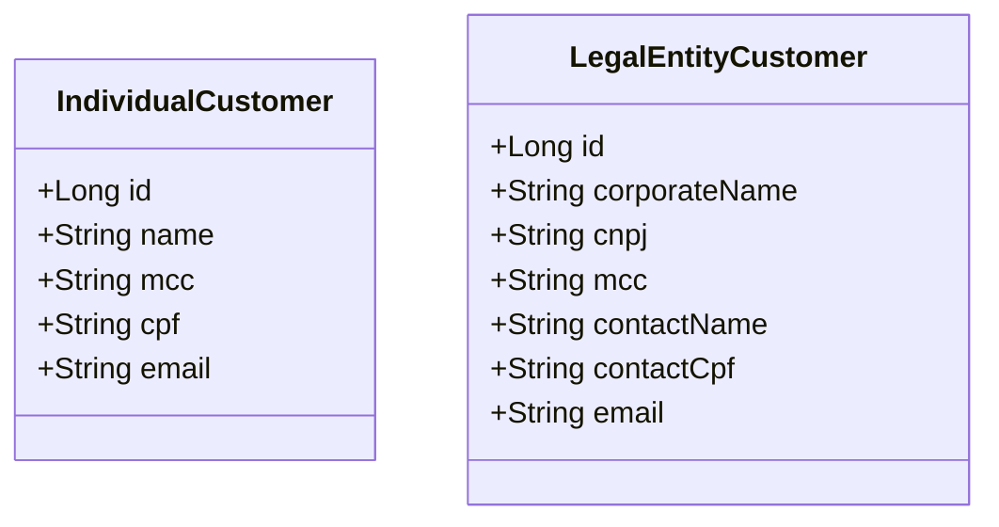

# Customer Prospecting App


# Instruções para rodar aplicação com o Docker

### 1. Clonar repositório

```
git clone https://github.com/Akaori/customer-prospecting-app.git

```

### 2. Mudar para diretório do repositório clonado

```
cd customer-prospecting-app
```

### 3. Subir serviços com o docker-compose
> É necessário ter o docker e docker-compose instalados. Para instalar no Ubuntu, seguir o seguinte tutorial: 
> https://www.digitalocean.com/community/tutorials/how-to-install-and-use-docker-compose-on-ubuntu-20-04-pt

```
docker-compose up
```

Os serviços de backend e frontend subirão automaticamente.

# Instruções de acesso aos serviços

### 1. Como entrar no Swagger

- Acessar a seguinte URL:

```
http://localhost:8080/swagger-ui/index.html#/
```


- Testar rotas

- Será necessário colocar as credencias para executar os endpoints:

  - user: `user`
  - password: `user`

> Exemplo de post request: (se o cadastro ou atualização do cadastro não obedecer as regras de cada campo, será mostrado um erro correspondente)


### 2. Como entrar no frontend

Acessar em:

```
http://localhost:3000/
```


# Overview do Projeto

## Estrutura de tabelas



## Acessibilidade WCAG 2 no Frontend

É possível ver alguns pontos da acessbilidade do site no seguinte pull request:

https://github.com/Akaori/customer-prospecting-app/pull/44


## Testes automatizados

- Testes unitários para os serviços
- CI com [Github Actions](https://github.com/Akaori/customer-prospecting-app/actions)