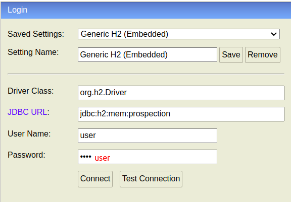

# Customer Prospecting App


## Como entrar no Swagger

- Acessar a seguinte URL:

```
http://localhost:8080/swagger-ui/index.html#/
```

- Será necessário colocar as credencias para executar os endpoints:

  - user: `user`
  - password: `user`

## Como entrar no H2

- Acessar a seguinte URL:

```
http://localhost:8080/h2-console
```

- Preenches os campos de acordo com a imagem abaixo:



- Clicar em `Connect`