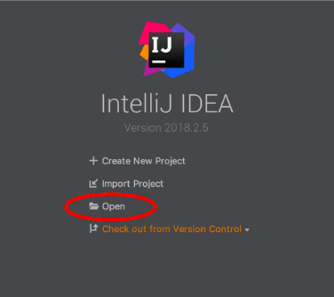
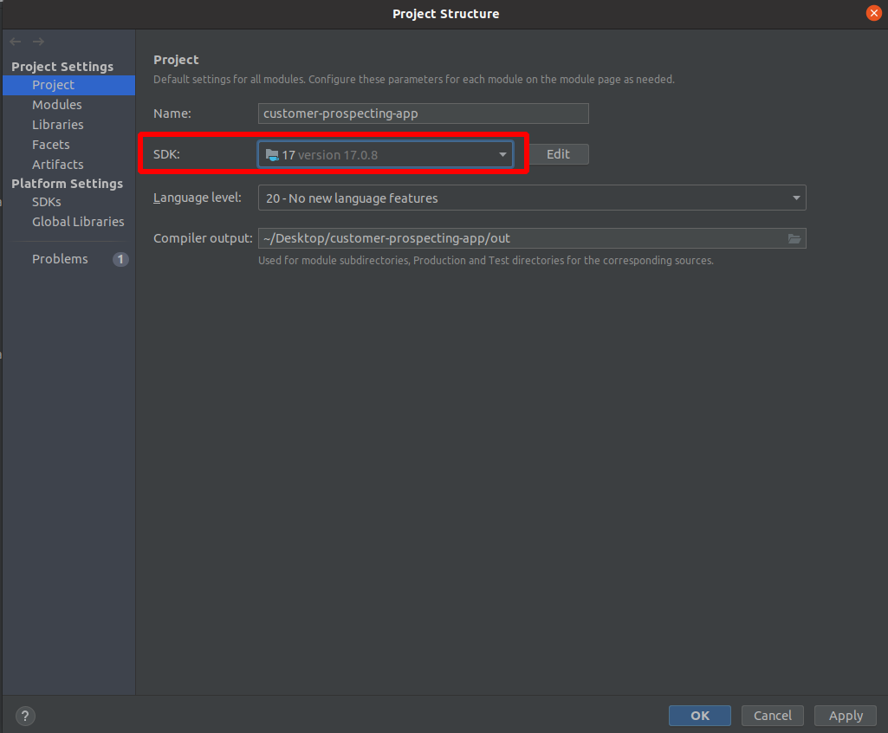
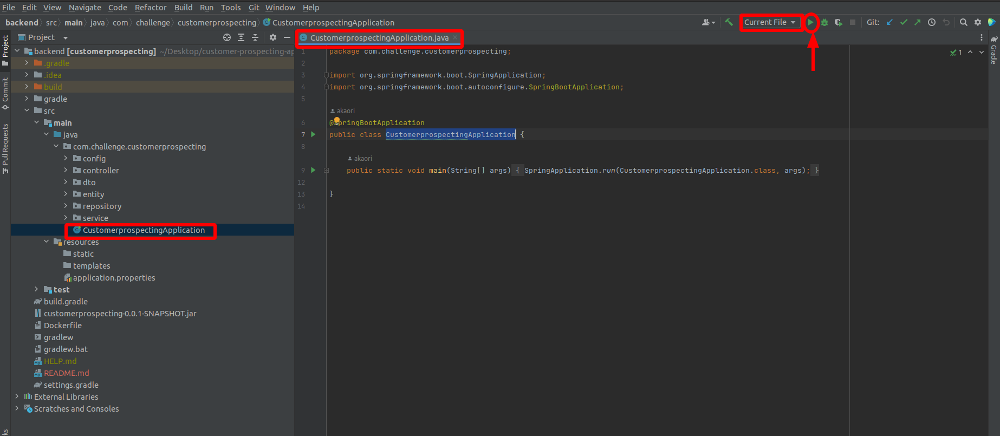

# Backend

> IMPORTANTE: A aplicação backend roda na porta 8080 por padrão. Caso a porta não esteja disponível, a aplicação poderá rodar em outra porta e afetará a comunicação com o frontend. Portanto, certifique-se que o backend rode na porta 8080.


## Como rodar o backend sem o Docker

### 1. Abrir o projeto do backend (pegar apenas a pasta do backend e não do projeto inteiro) no IntelliJ

Abra de acordo com a imagem abaixo ou em `File > Open`



### 2. Configurar Java SDK

- Vá em `File > Project Structure`
- Selecione o JAVA 17 de acordo com a imagem abaixo.




### 3. Rodar a aplicação

- Abra o arquivo `CustomerprospectingApplication.java` no IntelliJ
- Selecione `Current File` na barra superior (indicado na imagem)
- Clique para rodar (indicado na imagem com a seta vermelha)




### 4. Após rodar, será possível acessar a aplicação na seguinte URL:

```
http://localhost:8080/swagger-ui/index.html#/
```